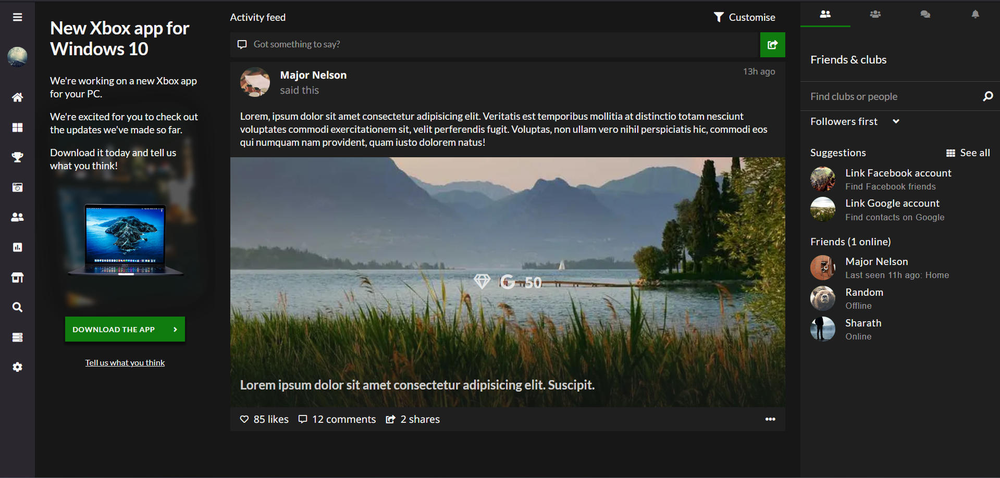
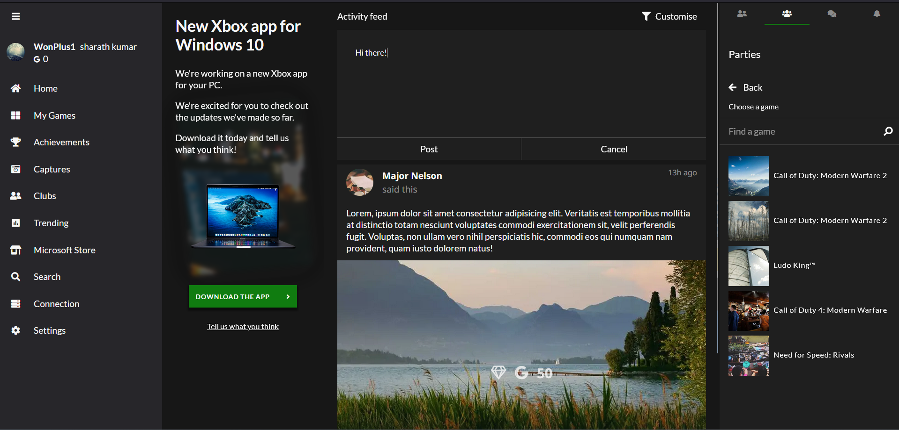

# ZBox
A clone of the new Xbox app for Windows 10, built using Vue 3 and TypeScript


# Screenshots



---



---

## Project setup
```
yarn install
```

### Compiles and hot-reloads for development
```
yarn serve
```

### Compiles and minifies for production
```
yarn build
```

### Lints and fixes files
```
yarn lint
```

### Customize configuration
See [Configuration Reference](https://cli.vuejs.org/config/).
